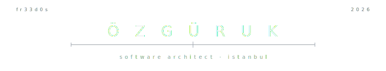

<div align="center">



<br/>

<a href="https://github.com/fr33d0s">
  
</a>

</div>

<br/>

```yml
# ─── model card ───────────────────────────────────────────────

agent         : özgür.uk
architecture  : human × code
training-set  : cognitive science · interface design · psychojs
checkpoint    : v26.04   @ istanbul (41.008° N, 28.978° E)
context       : perception  ×  intent  ×  interaction
temperature   : 0.4        # curious, not chaotic
alignment     : build tools that remember the human
status        : ● running  ·  UTC+03

# ─── one line from the training set ───────────────────────────
#  "the distance between stimulus and response
#   is where the self lives."
```

<br/>

<div align="center">

<sub><code>COMMS</code> &nbsp;·&nbsp; <a href="https://www.linkedin.com/in/ukozgr">linkedin</a> &nbsp;·&nbsp; <a href="https://github.com/fr33d0s?tab=repositories">repos</a></sub>

</div>

<!--
  no badges. no streak cards. no waving emoji.
  this page is a single transmission.
-->
